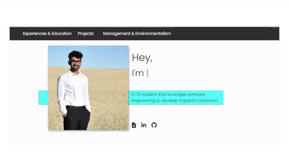

 
	<h2 align="center" style="text-align: center; margin-top: 5%">
        <a href="https://marmikpatel19.github.io/"> https://marmikpatel19.github.io/</a>     
    </h2>
    <h2>
        My personal website built using React and HTML/CSS. It includes Experiences & Education, Projects, and Management & Environmentalism.
    </h2>
    

